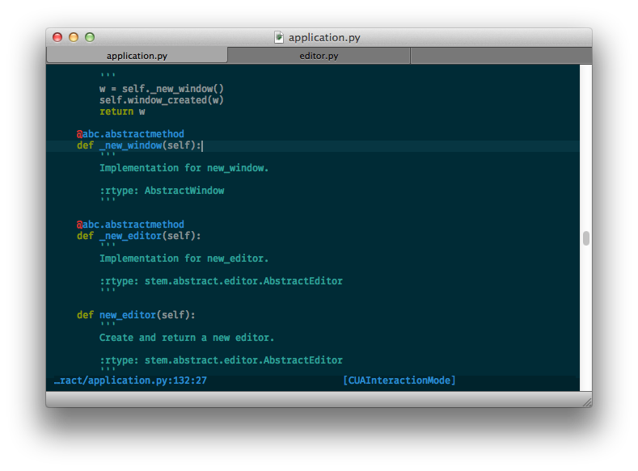
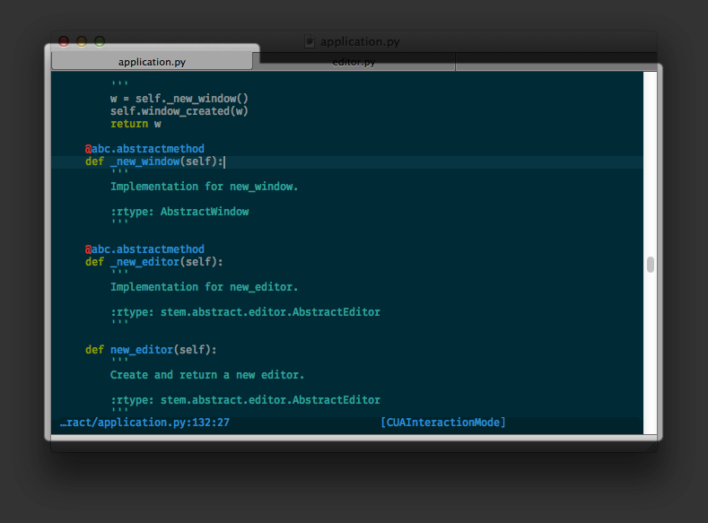

.. _plugin-creation-howto:

Plugin Creation HOWTO
*********************

:author: Sam Roth

.. topic:: Abstract
    
    This is an overview of how to create plugins for the Keypad text editor. 
    It provides a simpler overview of the concepts involved than the API documentation.
    Although the focus of this document is plugin construction, it may also
    help in understanding the architecture of the application.

Plugin Discovery
================

A plugin module is any Python module that makes one or more valid calls to
:py:func:`~keypad.core.plugin.register_plugin` when it is imported.

In order to make the plugins contained discoverable, a user must must import
the module from their ``stemrc.py`` file. This file is an ordinary Python
module that must be located somewhere on the ``PYTHONPATH``. It is
automatically loaded upon starting the editor.

Plugin Classes
==============

Each plugin class is a subclass of
:py:class:`~keypad.core.plugin.Plugin` and should contain at least the following,

*   An assignment to each of the following fields:

    * ``name``,
    * ``author``, and
    * ``version``; and

*   an implementation of at least the follwing methods

    * ``attach(self)`` and
    * ``detach(self)``.

Failing to implement either attach or detach will make it impossible to
instantiate your plugin class.

The :py:meth:`~keypad.core.plugin.Plugin.attach` method is called when your plugin is attached.
Likewise, the :py:meth:`~keypad.core.plugin.Plugin.detach` method is called when your plugin is detached.
These methods are called automatically. You should not call them except as part of tests.

Contributed Commands
====================

A plugin may contribute ``interactive`` commands by decorating methods with 
:py:class:`keypad.core.plugin.command`. These commands will automatically be registered and
deregistered when the plugin is loaded or unloaded.

Quick Example
=============

This is an example of a plugin class definition::

    from keypad.api import (Plugin,
                          register_plugin,
                          command,
                          app,
                          AbstractWindow)

    @register_plugin
    class HelloPlugin(Plugin):
        author = 'Sam Roth'
        version = '2014.06'
        name = 'Hello Plugin'

        def attach(self): pass
        def detach(self): pass

        @command('hello')
        def hello(self, win: AbstractWindow):
            app().message_box(win, 'Hello, world!', ['OK'])

When the command ``hello`` is given, a message box will appear with the text
"Hello, world!".

The API
=======
.. py:currentmodule:: keypad.api

:main article: :py:mod:`keypad.api`

Functions
---------
run_in_main_thread and Friends
^^^^^^^^^^^^^^^^^^^^^^^^^^^^^^

The :py:func:`~run_in_main_thread` function takes a function and injects it
into the event loop. As the name might suggest, this is useful for
synchronizing with the main thread.  Another use of
:py:func:`~run_in_main_thread` is to defer an action until later in the event
loop. This function returns immediately. It does not block until the function
returns.

Alternatively, if you would prefer to make a function that always runs in
another thread, you can use the :py:func:`~in_main_thread` decorator. Calling
such a function has the same effect as using the :py:func:`~run_in_main_thread`
decorator.

menu
^^^^
:todo:

User Interface Classes
----------------------

AbstractApplication
^^^^^^^^^^^^^^^^^^^

:py:class:`~AbstractApplication` contains the factory methods for
:py:class:`~AbstractWindow` and :py:class:`~AbstractEditor`, as well as signals
that are emitted when creating new windows and editors. Each frontend for the
application must implement this class, along with the other UI classes. This
class is a singleton (it has only one instance), and that instance may be
obtained by using its :py:meth:`~AbstractApplication.instance` method.

More generally, the responsibility of the :py:class:`~AbstractApplication`
class is to provide an implementation-neutral gateway to services provided by
the GUI library. Hence, it provides a `~AbstractApplication.message_box`
method, along with a `~AbstractApplication.timer` method.

AbstractWindow
^^^^^^^^^^^^^^

:py:class:`~AbstractWindow` represents a window (duh) that allows for viewing
zero, one, or multiple `~AbstractEditor` instances (not so duh). 

AbstractEditor
^^^^^^^^^^^^^^

`~AbstractEditor` represents a single primary text view, controlled by a
`~BufferController`, viewing a `~Buffer`. 

Control Classes
---------------

BufferController
^^^^^^^^^^^^^^^^

:todo:

Model Classes
-------------

AbstractCodeModel
^^^^^^^^^^^^^^^^^
:main howto: :ref:`code-model-creation-howto`
:todo:

Buffer
^^^^^^
:todo:

Cursor, Span, and Range
^^^^^^^^^^^^^^^^^^^^^^^
:todo:

Selection
^^^^^^^^^
:todo:

